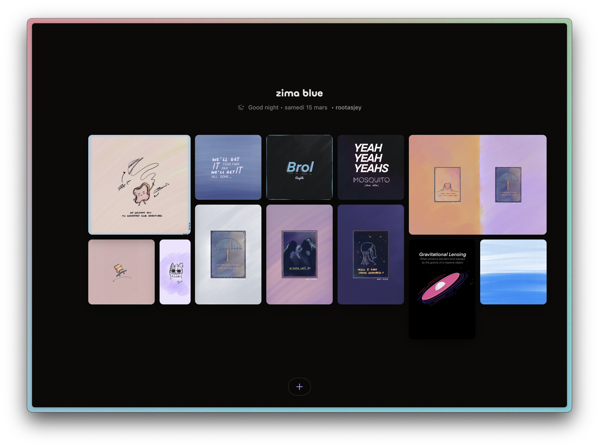

# zima blue

A modern image gallery application built with Nuxt.js and NuxtHub (Cloudflare Workers), providing fast and efficient image hosting and management.



[Go to website ↗ 🌓](https://zimablue.nuxt.dev/)

## Features

- Responsive image gallery layout
- Cloudflare Workers for optimized image delivery
- Built with Nuxt.js for optimal performance and SEO
- Server-side rendering capabilities
- Modern and intuitive user interface

## Tech Stack

- [Nuxt.js](https://nuxt.com/) - The Vue.js Framework
- [NuxtHub](https://hub.nuxt.com/) - Edge platform
- [UnaUI](https://unaui.com/) - UI component library
- [UnoCSS](https://unocss.dev/) - Utility-first CSS framework

## Getting Started

### Prerequisites

- Node.js (v16 or later)
- npm or yarn
- Cloudflare & NuxtHub account

### Installation

1. Clone the repository:
```bash
git clone https://github.com/rootasjey/zimablue.git
```

2. Install dependencies:
```bash
cd zimablue
npm install
```

3. Configure environment variables:
```bash
cp .env.example .env
```

4. Run development server:
```bash
npm run dev
```

### Deployment

1. Build the application:
```bash
npm run build
```

2. Deploy to Cloudflare Workers:
```bash
npm run deploy
```

## Contributing

Contributions are welcome! Please feel free to submit a Pull Request.

## License

This project is licensed under the MIT License - see the LICENSE file for details.
