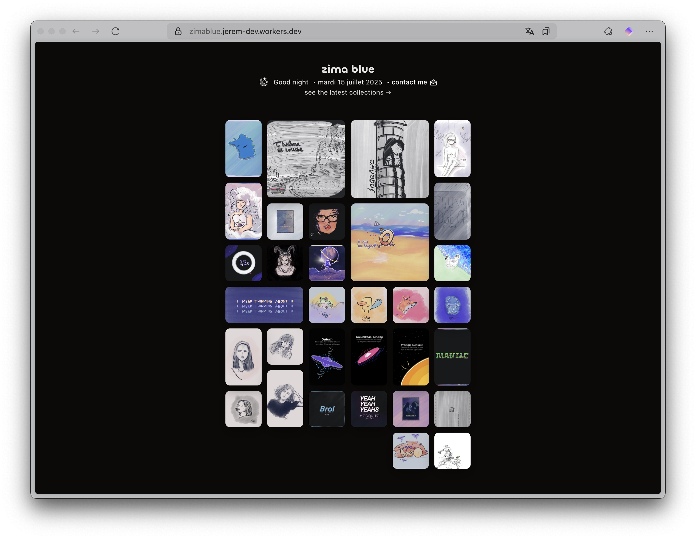

<h1 align="center" style="font-weight: 100;">zima blue</h1>

Discover new illustrations regularly.

Edge image gallery application built with Nuxt.js on NuxtHub (Cloudflare Workers), providing image hosting and management.



[Go to website ↗ 🌓](https://zimablue.cc/)

## Features

### 🖼️ Image Management
- **Drag & drop uploads** with automatic processing and variant generation
- **Multiple image variants** automatically created (xxs, xs, sm, md, lg, original)
- **Grid-based layout** with draggable and resizable image positioning
- **Image modal viewer** with smooth navigation controls
- **Statistics tracking** for views, likes, and downloads
- **Tagging system** for advanced image organization
- **Bulk operations** for efficient image management

### 📚 Collections System
- **Create and manage collections** to organize related images
- **Public/private visibility** controls for collection sharing
- **Collection cover images** and rich metadata support
- **Easy add/remove** images from collections
- **Collection analytics** and performance tracking

### 👤 User System
- **Secure authentication** with session management
- **Rich user profiles** with biography, job, location, and social links
- **Role-based access control** (user/admin permissions)
- **Personal galleries** and collection management

### 🎨 Modern UI/UX
- **Fully responsive design** optimized for all devices
- **Dark/light theme support** with smooth transitions
- **View transitions** and smooth animations
- **Interactive click fireworks** — a lightweight, full-screen fireworks animation plays when you click anywhere in the app. The effect is implemented in `components/ClickFireworks.vue` and uses the login page palette (cyan / blue / pink / fuchsia / yellow / amber).
- **Customizable grid layout** (draggable, resizable components)
- **Modern component library** with consistent design system
	- **Component prefix used in this repo:** UnaUI components are registered with the `N` prefix (e.g. `NButton`, `NDialog`, `NInput`) so the project uses PascalCase `N*` components across templates.
- **Accessibility-first** approach

### ⚡ Performance & Infrastructure
- **Edge deployment** on Cloudflare Workers for global performance
- **Automatic image optimization** and CDN delivery
- **Server-side rendering** for optimal SEO
- **Progressive enhancement** with client-side interactivity

## Architecture

### Frontend Stack
- **[Nuxt.js 4](https://nuxt.com/)** - Vue.js framework with SSR/SSG capabilities
- **[UnaUI](https://unaui.com/)** - Modern, accessible component library
- **[UnoCSS](https://unocss.dev/)** - Atomic CSS framework for rapid styling
- **[Pinia](https://pinia.vuejs.org/)** - Intuitive state management
- **TypeScript** - Full type safety and enhanced developer experience

### Backend & Infrastructure
- [**Cloudflare Workers edge platform**](https://workers.cloudflare.com/) - Application platform at the edge
- **Cloudflare D1** - Distributed SQLite database at the edge
- **Cloudflare R2** - Object storage for image assets
- **Cloudflare KV** - Key-value storage for caching and sessions
- **Cloudflare Cache** - Global edge caching for optimal performance

### Image Processing
- **[Jimp](https://github.com/jimp-dev/jimp)** - Server-side image manipulation
- **Automatic variant generation** in multiple optimized sizes
- **Custom image provider** for intelligent delivery
- **Grid layout positioning** system with persistence

### Development Tools
- **[Wrangler](https://developers.cloudflare.com/workers/wrangler/)** - CLI for Cloudflare Workers development

## Database Schema

The application uses a well-structured SQLite database with the following key tables:

### Images Table
- **Core metadata**: name, description, slug, pathname
- **Grid positioning**: x, y coordinates with width/height
- **Statistics**: views, likes, downloads tracking
- **Variants**: JSON array of generated image sizes
- **User association**: linked to user accounts

### Collections Table
- **Collection metadata**: name, description, slug
- **Visibility controls**: public/private settings
- **Cover image**: customizable collection thumbnails
- **Statistics**: comprehensive analytics tracking

### Users Table
- **Profile information**: biography, job, location
- **Authentication**: secure password handling
- **Social links**: JSON array of social media profiles
- **Role management**: user/admin permissions

### Junction Tables
- **Collection-Image relationships**: many-to-many associations
- **Positioning**: custom ordering within collections

## Getting Started

### Prerequisites

- Node.js (v16 or later)
- npm or yarn
- Cloudflare & NuxtHub account

### Installation

1. Clone the repository:
```bash
git clone https://github.com/rootasjey/zimablue.git
```

2. Install dependencies:
```bash
cd zimablue
npm install
```

3. Configure environment variables:
```bash
cp .env.example .env
```

4. Run development server:
```bash
npm run dev
```

### Deployment

1. Build the application:
```bash
npm run build
```

2. Deploy to Cloudflare Workers:
```bash
npm run deploy
```

## Contributing

Contributions are welcome! Please feel free to submit a Pull Request.

## License

This project is licensed under the MIT License - see the LICENSE file for details.
